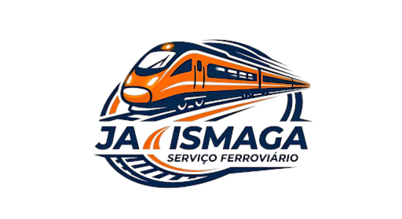
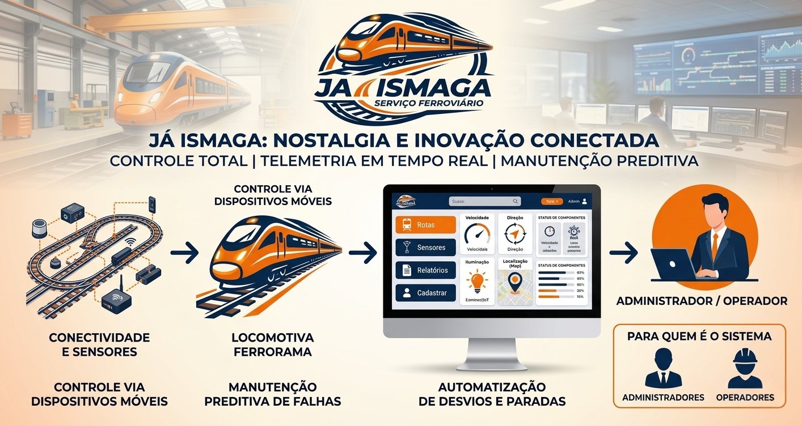

# Já Ismaga — Ferrorama IoT e Indústria 4.0

  
  

  

---

## Índice
- [Descrição do Projeto](#descrição-do-projeto)
- [Identidade Visual](#identidade-visual)
- [Funcionalidades do Sistema](#funcionalidades-do-sistema)
- [Tecnologias e Ferramentas](#tecnologias-e-ferramentas)
- [Desenvolvedores](#desenvolvedores)

---

## Descrição do Projeto

O projeto de **Ferrorama IoT da Já Ismaga** une a nostalgia do clássico brinquedo à vanguarda da **Indústria 4.0**, transformando linhas férreas e trilhos tradicionais em um ecossistema conectado, automatizado e inteligente.

A solução foca em tecnologia, automação e monitoramento ferroviário através do conceito de IoT (Internet of Things). O objetivo principal é criar uma plataforma inteligente para o acompanhamento e controle de informações da ferrovia em tempo real, integrando sensores, atuadores, conectividade sem fio e uma interface moderna para a visualização analítica dos dados. 

O sistema eleva o nível de controle e segurança operacional através da coleta e transmissão contínua de telemetria, mitigando falhas e otimizando o gerenciamento logístico.

  

---

## Funcionalidades do Sistema

Para melhor organização, as funcionalidades do ecossistema foram categorizadas em três pilares principais:

### 1. Controle de Acesso e Segurança (Autenticação)
* **Login de Usuários:** Interface segura para autenticação de operadores.
* **Validação de Credenciais:** Integração e checagem de acessos via banco de dados.
* **Sessão Secura:** Função de logout para encerramento de atividades na mesa de controle.

### 2. Monitoramento e Telemetria em Tempo Real
* **Localização no Mapa Interativo:** Exibição em tempo real do posicionamento exato da locomotiva ao longo dos trilhos.
* **Classificação Automática de Status:** Algoritmo que categoriza instantaneamente o estado operacional do trem em:
  * **Normal** (Operação padrão)
  * **Alerta** (Anomalia leve ou preventiva)
  * **Falha** (Interrupção ou risco iminente)
* **Atualização Dinâmica:** Interface Web que atualiza os dados automaticamente sem necessidade de recarregamento (Live Data Update).
* **Controle de Variáveis:** Monitoramento e ajuste remoto de velocidade, sentido de direção e iluminação dos componentes.

### 3. Gestão de Dispositivos (IoT) e Relatórios Preditivos
* **CRUD de Sensores:** Cadastro, listagem, visualização detalhada e exclusão de sensores ferroviários espalhados pela pista.
* **Manutenção Preditiva:** Análise do estado dos componentes para antecipar falhas antes que ocorram paradas não planejadas.
* **Automação de Desvios:** Controle inteligente de desvios de trilhos e paradas logísticas programadas.
* **Módulo Analítico:** Geração e histórico de visualização de relatórios de desempenho e métricas anteriores para auditoria.

---

## Tecnologias e Ferramentas

O desenvolvimento da interface web e controle do ecossistema utiliza as seguintes tecnologias:

  

* **Frontend:** HTML5, CSS3 e JavaScript (ES6+).
* **Framework Visual:** Bootstrap (Garantindo responsividade para dispositivos móveis).
* **Controle de Versão:** Git e GitHub.
* **Hardware e IoT (Conceitual):** Microcontroladores (como ESP32/Arduino) e Sensores Avançados de presença/velocidade.

---

## Desenvolvedores

Equipe responsável pelo planejamento, design e desenvolvimento do projeto **Já Ismaga**:

<table>
  <tr>
    <td align="center">
      <b>Jaime Rodrigues</b>
    </td>
    <td align="center">
      <b>Maria Eduarda</b>
    </td>
    <td align="center">
      <b>Isabela Albano</b>
    </td>
    <td align="center">
      <b>Gabriela Dias</b>
    </td>
  </tr>
</table>

---

Desenvolvido com foco na evolução da automação e conectividade industrial. Por Ícaro Botelho
