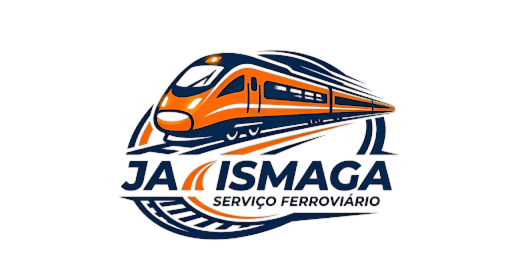

# Já Ismaga — Ferrorama IoT e Indústria 4.0

<p align="center">
  
  
</p>

<p align="center">
  
</p>

---

## Índice
- [Descrição do Projeto](#descrição-do-projeto)
- [Funcionalidades e Requisitos Funcionais (RFs)](#funcionalidades-e-requisitos-funcionais-rfs)
- [Metodologia de Desenvolvimento e Kanban](#metodologia-de-desenvolvimento-e-kanban)
- [Padrões de Código (Style Guide)](#padrões-de-código-style-guide)
- [Tecnologias e Ferramentas](#tecnologias-e-ferramentas)
- [Estrutura do Projeto](#estrutura-do-projeto)
- [Como Executar o Projeto](#como-executar-o-projeto)
- [Desenvolvedores](#desenvolvedores)

---

## Descrição do Projeto

O projeto de **Ferrorama IoT da Já Ismaga** une a nostalgia do clássico brinquedo à vanguarda da **Indústria 4.0**, transformando linhas férreas e trilhos tradicionais em um ecossistema conectado, automatizado e inteligente.

A solução foca em tecnologia, automação e monitoramento ferroviário através do conceito de IoT (*Internet of Things*). O objetivo principal é criar uma plataforma inteligente para o acompanhamento e controle de informações da ferrovia em tempo real, integrando sensores, atuadores, conectividade sem fio e uma interface moderna para a visualização analítica dos dados. 

O sistema eleva o nível de controle e segurança operacional através da coleta e transmissão contínua de telemetria, mitigando falhas e otimizando o gerenciamento logístico.

<p align="center">
  
</p>

---

## Funcionalidades e Requisitos Funcionais (RFs)

As funcionalidades do ecossistema foram categorizadas em três pilares, associadas aos Requisitos Funcionais (RFs) do projeto:

### 1. Controle de Acesso e Segurança (Autenticação)
* **[RF01] Login de Usuários:** Interface segura para autenticação de operadores.
* **[RF02] Validação de Credenciais:** Integração e checagem de acessos via banco de dados MySQL.
* **[RF03] Sessão Segura:** Função de logout e controle de permissões para encerramento de atividades na mesa de controle.

### 2. Monitoramento e Telemetria em Tempo Real
* **[RF04] Localização no Mapa Interativo:** Exibição em tempo real do posicionamento exato da locomotiva ao longo dos trilhos.
* **[RF05] Classificação Automática de Status:** Algoritmo que categoriza instantaneamente o estado operacional do trem (*Normal*, *Alerta*, *Falha*).
* **[RF06] Atualização Dinâmica (Live Data):** Interface Web que atualiza os dados automaticamente sem recarregamento da página.
* **[RF07] Controle Remoto de Variáveis:** Monitoramento e ajuste remoto de velocidade, sentido de direção e iluminação.

### 3. Gestão de Dispositivos (IoT) e Relatórios Preditivos
* **[RF08] CRUD de Sensores:** Cadastro, listagem, visualização detalhada e exclusão de sensores ferroviários na pista.
* **[RF09] Manutenção Preditiva:** Análise do estado dos componentes para antecipar falhas operacionais.
* **[RF10] Automação de Desvios:** Controle inteligente de desvios de trilhos e paradas logísticas programadas.
* **[RF11] Módulo Analítico e Relatórios:** Geração e histórico de relatórios de desempenho e métricas operacionais para auditoria.

---

## Metodologia de Desenvolvimento e Kanban

Para a condução do projeto, a equipe adotou a metodologia **Scrumban** (combinação entre **Scrum** e **Kanban**).

### Justificativa da Escolha:
A combinação do Scrum com o Kanban garante à equipe a agilidade e a previsibilidade necessárias para entregas acadêmicas em etapas, mantendo total flexibilidade visual sobre o fluxo de trabalho.
* O **Kanban** fornece transparência imediata sobre o status de cada tarefa (*To Do*, *In Progress*, *In Review*, *Done*), evitando sobrecarga nos desenvolvedores e identificando gargalos rapidamente.
* Os ritos do **Scrum** (planejamento de etapas, revisões e alinhamentos constantes) mantêm a equipe em sincronia quanto aos prazos e prioridades dos Requisitos Funcionais.

### Gestão e Acompanhamento das Tarefas:
O acompanhamento do desenvolvimento é realizado via **GitHub Projects**. Cada card no board contém obrigatoriamente:
- **Título claro da ação**
- **Descrição das atividades**
- **Requisito Funcional (RF) relacionado**
- **Membro responsável**
- **Status de execução**

**Link do GitHub Projects (Kanban):** [Acesse o Board do Projeto Aqui](https://github.com/jaime168-arch/SA_1/projects)
---

## Padrões de Código (Style Guide)

Para garantir a consistência e organizacão do repositório, a equipe estabeleceu as seguintes regras de desenvolvimento:

### 1. Nomenclatura de Arquivos e Pastas
* **Arquivos Web, PHP, JS e CSS:** Padrão `kebab-case` em minúsculas (ex: `c-sensor.php`, `cadastro.js`, `style.css`).
* **Arquivos de Documentação:** Padrão `kebab-case` em minúsculas dentro da pasta `doc/` (ex: `identidade-visual.md`, `pesquisa-crud.md`).
* **Variáveis e Funções (JS/PHP):** Padrão `camelCase` (ex: `validarUsuario()`, `statusSensor`).
* **Constantes:** Padrão `UPPER_SNAKE_CASE` (ex: `LIMITE_VELOCIDADE`).

### 2. Boas Práticas de Código
* **Indentação:** Espaçamento padrão de 2 espaços em arquivos HTML, PHP, CSS e JS.
* **Comentários:** Utilizados apenas para explicar regras de negócio complexas (*Clean Code*).
* **Idioma:** Nomenclatura em português alinhada ao domínio do projeto Ferroramas.

---

## Tecnologias e Ferramentas

O ecossistema utiliza as seguintes tecnologias:

<p align="left">
  <a href="https://skillicons.dev">
    
  </a>
</p>


---

## Estrutura do Projeto

A estrutura de diretórios do repositório está organizada da seguinte forma:

```text
/
├── assets/                  # Imagens, logos e recursos visuais
├── doc/                     # Documentações e pesquisas do projeto
├── public/                  # Arquivos e páginas PHP do sistema
├── scripts/                 # Scripts e lógicas em JavaScript
├── styles/                  # Folhas de estilo CSS
├── index.php                # Arquivo principal / Inicial da aplicação
├── LICENSE
├── README.md                # Documentação oficial do projeto
└── WorkBench.SQL            # Script do banco de dados MySQL