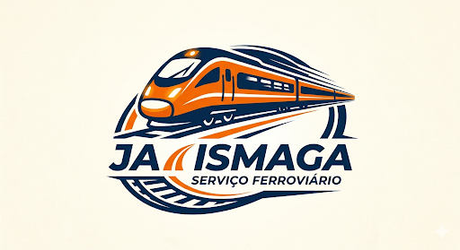

# Indentidade Visual - Já ismaga

A indentidade visual da **Já ismaga** busca equilibrar a nostalgia do ferrorama com a modernidade da industria 4.0.

## 1. Conceito e Logo
O conceito une trilhos lineares a caminhos de circuitos impressos (PCB), simbolizando a fusão entre o mecânico e o digital. A marca foca na "esmagagem" da complexidade.

## 2. Paleta de Cores
* **Azul Tecnológico (#1A237E):** Representa a confiança, a segurança e tecnológia Cloud que apresentamos.
* **Laranja Alerta (#FF6D00):** Remete à energia de automações e de botões de ação.
* **Off-White (#FFFDF2):** Essa cor traz tranquilidade e sofisticação para o site

## 3. Interface do usuário (UI)
* **Dark Mode:** Utilizando no dashboard para destacar dados de telemetria.
* **Tipografia:** Uso de fornte modernas sem serifa para garantir legibilidade técnica.