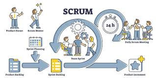

# Pesquisa scrum - Já Ismaga

O projeto **Já Ismaga** transforma o ferrorama clássico em um ecossistema IoT da Indústria 4.0, utilizando sensores e microcontroladores para monitorar telemetria e controlar velocidade e direção em tempo real. A estrutura técnica conta com interfaces web para login, cadastro e um dashboard de controle (Home) com listagem de usuários, tudo estilizado com Bootstrap e focado na manutenção preditiva. Para organizar esse desenvolvimento complexo, a equipe utiliza a metodologia **SCRUM**, que divide o trabalho em ciclos rápidos (**Sprints**) e reuniões diárias (**Dailies**). Com papéis definidos entre Product Owner, Scrum Master e desenvolvedores, o uso do SCRUM garante que a integração entre hardware e software seja ágil, transparente e eficiente, unindo a nostalgia do brinquedo à precisão da automação moderna.